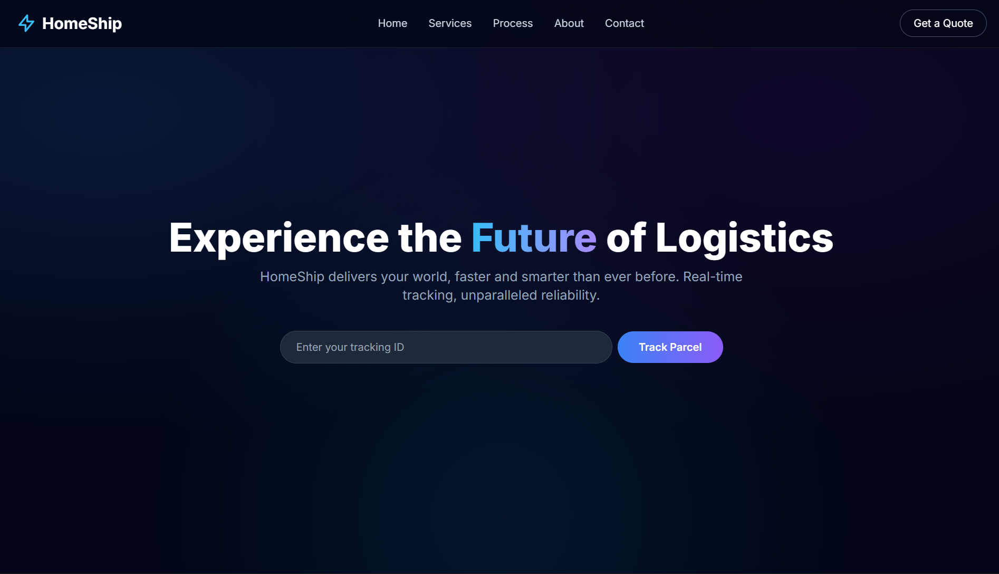
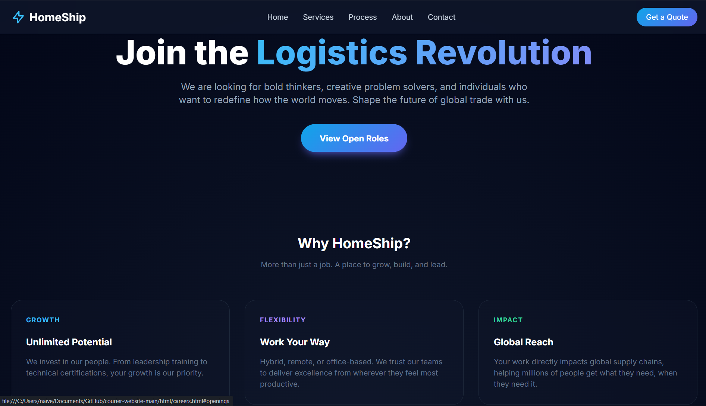
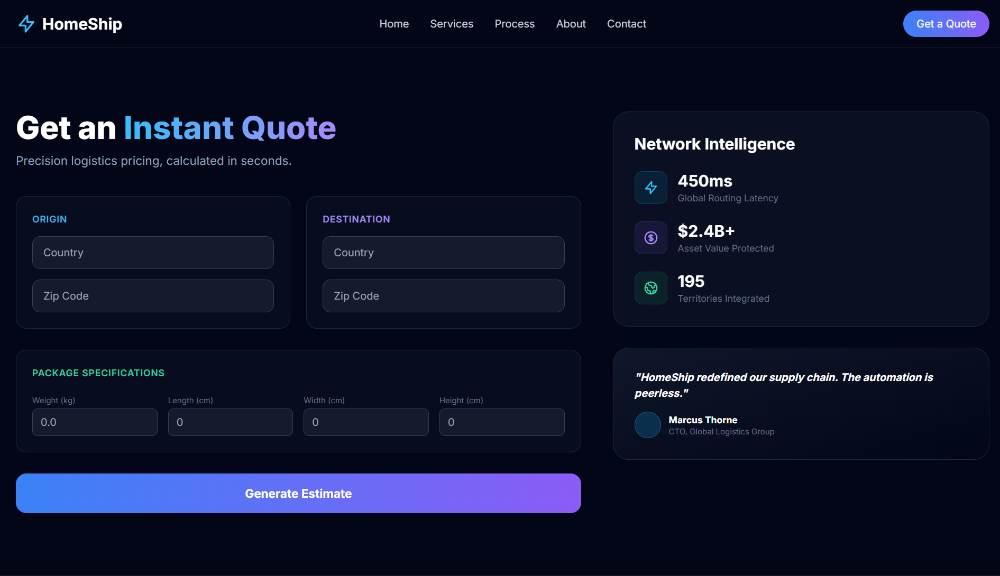

# ⚡ HomeShip - Modern Logistics Platform

[](https://naivedhp2518.github.io/courier-website/)

HomeShip is a premium, high-performance courier and logistics website built with a focus on **visual excellence**, **clean routing**, and **modern UX**. It features a glassmorphic dark-mode aesthetic, smooth scroll animations, and a fully responsive architecture.

---

## 🚀 Tech Stack

| Category          | Technology                                    |
| :---------------- | :-------------------------------------------- |
| **Frontend**      | HTML5, Tailwind CSS (via CDN)                 |
| **Styling**       | Vanilla CSS (Custom tokens), Glassmorphism    |
| **Interactivity** | Vanilla JavaScript, Intersection Observer API |
| **Icons**         | Heroicons, Lucide-style SVGs                  |
| **Typography**    | Inter (Google Fonts)                          |

---

## 📂 Project Structure

```bash
courier-website-main/
├── assets/             # Branding and UI screenshots
│   ├── Image1.png
│   ├── Image2.png
│   └── image3.png
├── css/                # Style layers
│   └── style.css       # Core design system and animations
├── html/               # Specialized pages (Secondary Routing)
│   ├── about.html      # Mission and values
│   ├── careers.html    # Job board and culture
│   ├── press.html      # Newsroom and media kit
│   └── quote.html      # Premium interactive quote form
├── js/                 # Logic layer
│   └── script.js       # Animations and global interactions
└── index.html          # Main landing page (Entry point)
```

---

## 🎨 Visual Preview

| Page / Feature       | Concept Preview                  |
| :------------------- | :------------------------------- |
| **Core Branding**    |    |
| **UI Aesthetics**    |   |
| **Component Layout** |  |

---

## ✨ Key Features

- **Premium Dark Mode**: A sophisticated palette using radial gradients and slate tones.
- **Glassmorphism**: Advanced backdrop-filter effects for navigation and cards.
- **Clean Routing**: Organized `html/` directory for secondary pages to ensure a tidy workspace.
- **Responsive Navigation**: Mobile-optimized slide-out menu with smooth transitions.
- **Scroll Reveals**: Intersection Observer driven animations for a "dynamic" feel during browsing.

---

## 🛠️ Performance Highlights

- **Lightweight**: Zero heavy dependencies; lightning-fast load times.
- **SEO Optimized**: Semantic HTML5 structure and descriptive meta tags.
- **Scaleable**: Modular CSS and component-based organization for easy expansion.

---

© 2025 HomeShip Logistics. Designed for the future of global transit.
